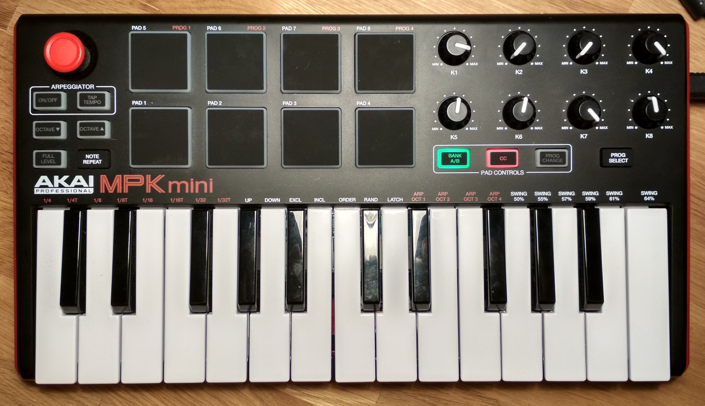

# Bitwig Extension for AKAI MPK mini mk2

[](https://travis-ci.org/klingtnet/bitwig-akai-mpk-mini-mk2)

A barebones Bitwig extension for AKAI's MPK mini mk2, with those features:

- knobs are automapped to macro controls of the selected device
- pads are automapped to the first 8 samples of the drum machine selected
- x-axis of joystick controller sends Pitchbend
- y-axis of joystick controller is assignable and not automapped

## Controller settings

I assume that the default controller programs are used.
To use the extension the controller must be in `PROG 4` which you can select like this:

- press and hold `PROG SELECT`
- press `PAD 8`
- release both

To use the automapping for pads the controller must be in `CC` mode.



## Installation

The recommend installation method is to download a precompiled release from [this projects release page](https://github.com/klingtnet/bitwig-akai-mpk-mini-mk2/releases) into your `~/Bitwig Studio/Extensions` folder.
Note that the `Extensions` path is probably different for Windows or Mac.

### From Source (Development)

```sh
$ make install
```
